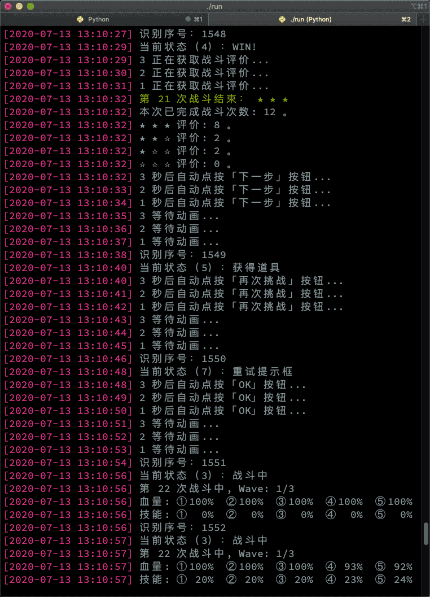

# PCRe:Battle

## 超异域公主焊结(国服)自动重新挑战工具

　
ヤバイわよ　跳过劵用完了　qwq

## 0x0
- 因为还有一些识别方面的小 bug 在咕，所以数据不准确或某些关卡无法运行是正常现象。
- 还有很多平台组合没有被测试（已测试的平台请参见 [已通过测试的平台](已通过测试的平台) ），所以不一定所有系统设备和版本都能用。
- 目前只能适用于 简体中文 游戏服务器，在其他服务器可能无法正常使用。因此，本程序也没有提供其他语言版本。
- 请详细按照 [开始之前……](#开始之前……) 节进行操作，否则会无法运行。
- 实时数据、评价记录功能当前还不准确，仅供参考。
- 欢迎提交 PR 让它支持更多平台组合和语言～

【 [功能](#功能) | [适用](#适用范围) | [平台](#已通过测试的平台) | [原理](#原理) | [环境](#环境要求) | [安装](#安装) | [准备](#开始之前……) | [运行](#运行) | [协议](#协议) | [截图](#截图) 】

## 功能
由于游戏版本持续演进，不保证以下功能一直可用并且不会出现意外操作。

- [x] 显示当前战斗状态（不保证识别精确，仅供参考）
  - [x] 场上每个角色的血量
  - [x] 场上每个角色的技能
  - [x] 当前战斗波次
  - [x] 战斗结束评星
- [x] 自动重新挑战
  - [x] 自动点按「下一步」按钮
  - [x] 自动点按「再次挑战」按钮
  - [x] 自动点按「OK」按钮
- [x] 异常处理
  - [x] 处理灭团情况（自动停止程序）
  - [x] 处理提示框（体力不足/限定商店/断线等）
  - [x] 处理 ADB 意外断线
  - [x] 处理分辨率不符合要求
- [x] 增强功能
  - [x] 点击按钮时，使用随机点击位置
    - 模拟用手指点击操作，不会每次都点按钮的一个位置。
  - [x] 只读模式：
    - 如果你不放心电脑控制游戏点按，可以打开此模式。
    - 只截图和提醒，不向设备发送点击命令，到时自动弹窗提醒并退出。
    - 需要手工再次进入战斗后，再重新打开本程序。
  - [x] 数据统计：
    - 每次打完和按退出快捷键时显示本次运行期间战绩统计（不保证识别精确，仅供参考）。

## 适用范围
- 仅用于 普通PVE 非BOSS 战斗 (3 wave)
- 暂不支持 探索 关卡的自动重开，仅能监控状态
- 不可用于其他战斗场景（没有适配，会导致错误或异常操作！）
- 禁止用于任何 PVP 场景

## 已通过测试的平台

欢迎PR补充可用组合，未列出的平台可能无法正常运行：

- [x] macOS Catania + MuMu 模拟器 1.9.15

## 原理
- 通过 adb 连线获取截图，然后分析截图。
- 根据截图分析结果通过 adb 发送点击屏幕操作。
- 因此，本程序不会：
  - 读取/修改 游戏的 内存数据
  - 读取/修改 游戏的 文件数据
  - 读取/修改 游戏的 网络数据包
  - 需要/请求 设备的 ROOT 权限
  - 需要/请求 电脑的 管理员权限

## 环境要求
- macOS / Windows / Linux
- 安装 adb 命令，确保 adb 命令可用
- 安装 Python 3 (不支持 2)
- 设备/模拟器不要开画面优化或修改色度对比度等画面调整功能

## 安装
- 下载 py 脚本文件
- 前往命令行安装必备库
  - `pip3 install opencv-python numpy pandas`

## 开始之前……
- 用文本编辑器打开脚本文件 `pcreb.py` ，编辑以下变量（不编辑运行应该会出错）：
  - line 17: `tempdir`
    - 设定临时工作文件夹，以路径符号 / 或 \ 结尾。
    - Windows 应使用带转义字符的双斜杠 `\\` 。
    - 建议设置为内存盘 (RAMDisk) 以减少硬盘磨损。
  - line 19: `refreshspeed`
    - 刷新速度（秒），即每间隔多久进行一次截图、分析、操作。
    - 设置得越低，状态监控显示速度越快，等待时间更少，但电脑和设备的负载也越大。
    - 如果设置得过低，会因为设备截图速度跟不上或硬盘读写 (I/O) 跟不上而导致运行出错。
    - 设置为内存盘 (RAMDisk) 以及将 Android 运行于高速固态存储设备中，可以允许你把它设置得更低。
- 确保设备支持 1280x720 分辨率，一般模拟器都支持的。
  - 其他分辨率设备和模拟器请勿运行，会导致错误或异常操作！
  - 在游戏启动后，可以随意调节模拟器窗口大小。
- 打开 USB 调试：
  - 如果是 MuMu 模拟器，[连接方式请看这里](http://mumu.163.com/2017/12/19/25241_730476.html)。

## 运行
- 运行游戏。
- 前往命令行：
  - `python3 pcreb.py`
  - 如果需要使用只读模式，可以在命令行加 ` r` 参数，例如：
    - `python3 pcreb.py r`
- 进图战斗。
- 根据提示按回车继续。
- 不要再动设备。
- 可以随时按 `Ctrl+C` 中止程序。

## 协议
- 使用和下载本程序，即表示同意以下协议：
  - 程序使用 GPLv3 开源协议，详见 [LICENSE](LICENSE)。
  - 不用于二次开发商用闭源程序 和 嵌入于商用闭源程序。
  - 不基于本程序开发违法外挂程序。
  - 使用本程序所引起的任何游戏相关问题（包括并不限于封号、抽卡只有保底等），作者不承担任何责任。

## 截图
